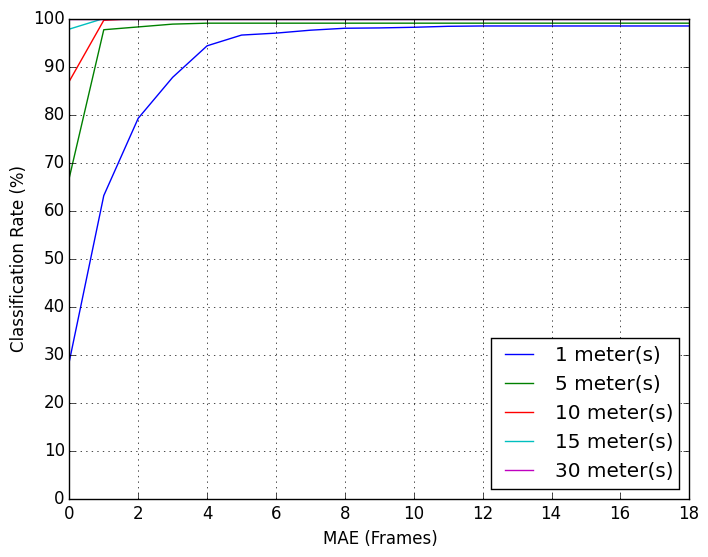
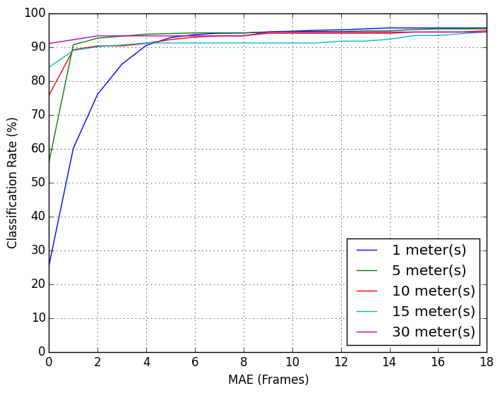
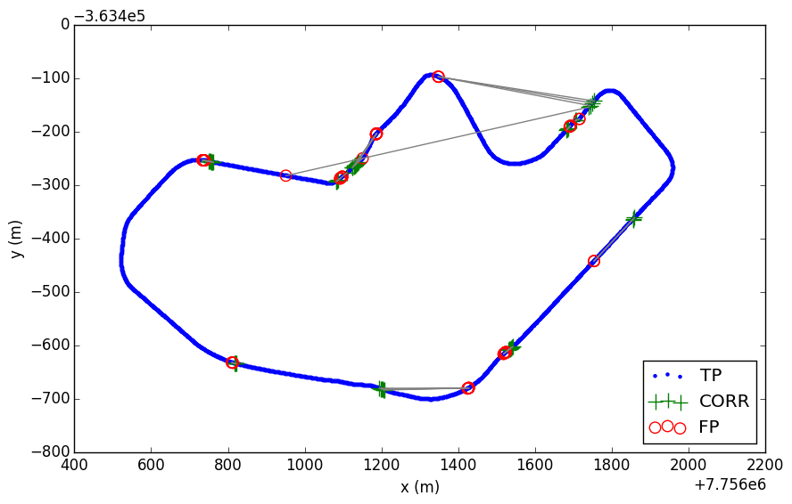
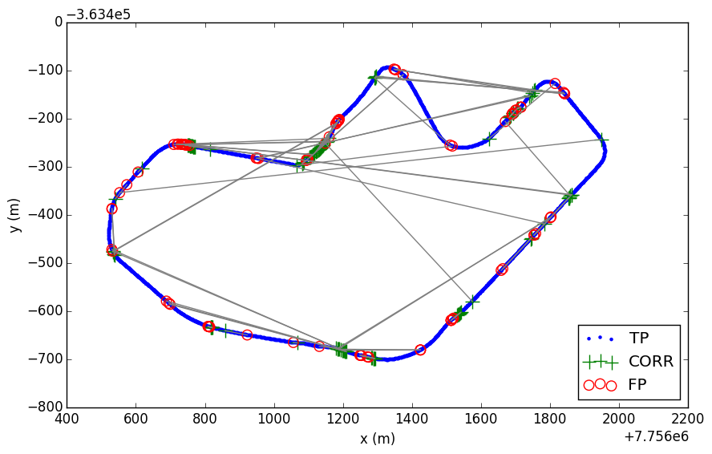

# ensemble_lcad
The ensemble_lcad repository contains implementations for ensembles of kNN classifiers using metrics such as Hamming distance alone and in conjunction with DTW.

## Introduction

It was proposed in [1] a new Sequential Appearance-Based approach to the Global Localization problem. It is based on an ensemble of kNN classifiers, where each classifier uses the Dynamic Time Warping (DTW) and the Hamming distance to compare binary features extracted from sequences of images. 

## Preparing datasets

In [1], it was collected two laps data in different dates for experimenting with. For each lap, a robotic car was driven with an average speed of 25 km/h around UFES campus. An entire lap around the university campus has an extension of about 3.57 km. During the laps, image and robot's pose data were acquired synchronously.

The first lap data was recorded on 3rd of October 2012 (UFES-2012) and comprises a sequence of 5,821 image-pose pairs, while the second lap data was recorded on 18th of April 2014 (UFES-2014) and comprises a sequence of 4,414 image-pose pairs. The difference in size between same spacing datasets is mainly due to frame rate difference between recordings. 

To evaluate the effect of learning an increasing number of images, the UFES-2012 dataset was sampled at five different intervals: 30m, 15m, 10m, 5m and 1m. After sampling the UFES-2012, five datasets were created: a 1-meter spacing dataset with a total of 2,536 image-pose pairs, a 5-meter dataset with a total of 646 image-pose pairs, a 10-meter dataset with 333 image-pose pairs, a 15-meter dataset with 225 image-pose pairs, and a 30-meter dataset with 114 image-pose pairs. The same was done with the UFES-2014 resulting in five datasets with a total of 2,283, 635, 331, 224 and 113 image-pose pairs. 

In average and without sampling, the distances between UFES-2012 and UFES-2014 corresponding image-pose pairs is 1.20m and standard deviation equals to 0.96. Conversely, the distances between UFES-2014 and UFES-2012 corresponding image-pose pairs is 1.38m and standard deviation equals to 1.04. 

All datasets mentioned above are available at The dataset is available at [http://www.lcad.inf.ufes.br/log](http://www.lcad.inf.ufes.br/log). 

To validate the proposed system for the global localization problem, a set of experiments was run with the datasets mentioned above. The UFES-2012 datasets were used to train the system about the trajectory and the UFES-2014 datasets were used to test the accuracy of the system by estimating poses along the previous experienced trajectory. Conversely, the UFES-2014 datasets were used for training and the UFES-2012 datasets for test. The ground-truth was established using the Euclidean distance between pairs of image-pose from each lap.

## Additional experiments taking UFES-2014 for training and UFES-2012 for test

### Classification Accuracy

||
:-------------:
|**a**|

||
:-------------:
|**b**|

|**Fig. 1. Classification accuracy of SABGL (a) and VibGL (b) for different Maximum Allowed Error (MAE) in frames using UFES-2014 dataset for training an the UFES-2012 dataset for test.**|

### True and False Positives

||
:-------------:
|**a**|

||
:-------------:
|**b**|

|**Fig. 2. True and false positives for SABGL (a) and VibGL (b) using 1-meter spacing UFES-2014 dataset for training and 1-meter spacing UFES- 2012 dataset for test. Blue dots represent true positives (TP); lines connect false positives (FP) represented by red circles and their respective ground-truth correspondences represented by green crosses (CORR)**|

## Video demonstration

The demo video is available at https://youtu.be/ZA6VIPApyMw

## References

    [1] Avelino Forechi, Alberto F. De Souza, Claudine Badue, Thiago Oliveira-Santos, "Sequential Appearance-Based Global Localization Using an Ensemble of kNN-DTW Classifiers", submitted to IJCNN'2016.
